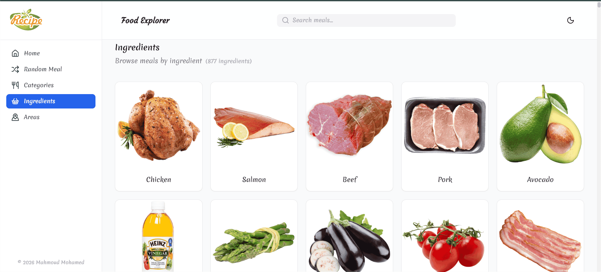
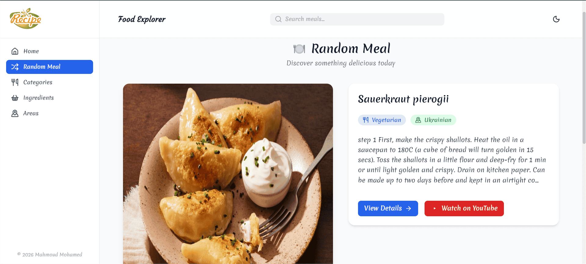

# 🍽️ Meals Explorer App

Food Explorer is a modern React-based food discovery web application that allows users to explore meals from around the world by categories, ingredients, areas, search, and random selection.
Built with **React**, **React Router**, and **Tailwind CSS**, focusing on clean UI, reusable components, and smooth user experience.

---

## 🚀 Live Demo

> *[Live Demo](https://mahmood-mohamed.github.io/recipesReact/)*

---

## 🎯 Features

*  **Search meals** by name to find specific results
*  **Browse by Categories**
*  **Browse by Ingredients**
*  **Browse by Areas (Countries)**
*  **Filter meals by first letter**
*  **Random Meal page** with reload button
*  **Skeleton loaders** for better UX
*  **Dark / Light mode support**
*  **Accessible & semantic HTML structure**
*  **Fully responsive design**

---

## 🧱 Tech Stack

* **React**
* **React Router DOM**
* **Axios**
* **Tailwind CSS**
* **Lucide Icons**
* **Framer Motion**
* **TheMealDB API**

---

## 📂 Project Structure

```text
src/
├── components/       # Reusable UI components
├── data/             # Static data
├── hooks/            # Custom hooks
├── pages/            # Application pages
├── services/         # API layer (mealsApi)
└── utils/            # Helper functions
```

---

## 🔌 API Integration

All API calls are centralized in:

```text
src/services/mealsApi.js
```

This ensures:

* Clean separation of concerns
* Easy maintenance
* Reusable data-fetching logic

---

## 🧠 UX & Performance Enhancements

* Smooth scroll-to-top button
* Empty & error states handled gracefully

---
https://.github.io/recipesReact/
## 🛠️ Installation & Setup

```bash
# Clone the repository
git clone https://github.com/mahmood-mohamed/recipesReact.git

# Navigate to the project directory
cd recipesReact

# Install dependencies
npm install

# Run the development server
npm run dev
```

---

## 📸 Screenshots from application

### 🏠 Home Page – Discover Recipes


### 🍴 Categories Page – Browse Meals by Category


### 🧺 Ingredients Page – Browse Meals by Ingredient


### 🎲 Random Meal Page – Get Inspired Instantly


### 🌍 Areas Page – Explore Meals by Country


---
## 🧪 Future Improvements

* 🌐 Multi-language support (Arabic / English)

---

## 👨‍💻 Author

**Mahmoud Mohamed**
Front-End / Full Stack Developer

* LinkedIn: *https://github.com/mahmood-mohamed*
* GitHub: *https://www.linkedin.com/in/mahmoud.mo/*

---

## ⭐ Acknowledgments

* [TheMealDB API](https://www.themealdb.com/) for the amazing free API

---

> If you like this project, feel free to ⭐ the repository!
